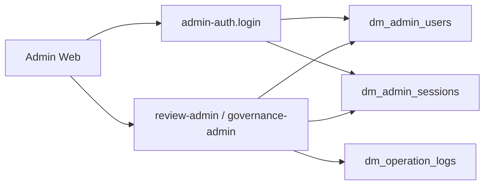

# 多米通告 CloudBase 后台鉴权规范 V1

## 1. 文档信息

- 文档名称：CloudBase 后台鉴权规范 V1
- 对应技术选型：[Technical-Architecture-Selection-V1.md](Technical-Architecture-Selection-V1.md)
- 对应后台需求：[Admin-Operations-Backend-PRD-V1.md](../product/Admin-Operations-Backend-PRD-V1.md)
- 对应后端总文档：[CloudBase-Backend-Development-Guide-V1.md](CloudBase-Backend-Development-Guide-V1.md)
- 文档日期：2026-03-16
- 文档目标：锁定运营后台的身份体系、角色模型、会话机制与权限校验方式，避免后台开发时临时拍脑袋决定鉴权实现

## 2. 目标与范围

### 2.1 目标

1. 为独立 Web 运营后台提供与小程序用户体系完全分离的后台登录机制。
2. 保障审核、举报、处罚、日志查询等后台操作都具备明确的身份识别和角色校验。
3. 让 `review-admin`、`governance-admin` 等后台云函数有统一可复用的鉴权中间层。

### 2.2 范围

本文档覆盖：

1. 后台管理员账号模型
2. 会话令牌模型
3. 角色与权限矩阵
4. `admin-auth` 云函数设计
5. 后台请求鉴权流程
6. 初始管理员开通与密码管理策略

### 2.3 非目标

1. 不做企业级 SSO
2. 不做多租户权限系统
3. 不做后台用户自助注册
4. 不做复杂权限配置 UI

## 3. 设计原则

1. 后台身份体系不复用小程序 `OPENID`。
2. 后台所有业务操作都必须通过已登录管理员身份执行。
3. 会话令牌使用服务端可撤销的有状态 session，而不是纯前端自解释 token。
4. 角色先固定为 `reviewer`、`ops_admin`、`super_admin` 三档，不做过度设计。
5. 所有后台敏感动作都要同时经过“已登录校验 + 角色校验 + 操作日志”三层保护。

## 4. 总体方案

### 4.1 总体结论

V1 推荐方案：

1. 独立 `admin-auth` 云函数负责登录、登出、当前登录态和改密。
2. 使用 `dm_admin_users` 管理后台账号。
3. 使用 `dm_admin_sessions` 管理后台会话。
4. 管理端调用业务云函数时，通过 `meta.adminSessionToken` 传递后台 session token。
5. 后台业务云函数统一通过共享 `requireAdminAuth()` 完成会话校验和角色断言。

### 4.2 后台鉴权链路



### 4.3 为什么 V1 不复用小程序身份

1. 小程序用户与后台管理员不是同一类角色。
2. 后台存在更高风险动作，不能只依赖小程序用户体系附带的身份信息。
3. 后台账号数量少、权限固定，独立维护成本低于后期补救。

## 5. 支撑集合设计

### 5.1 `dm_admin_users`

用途：

1. 存储后台管理员基础资料和角色。
2. 承载密码状态、登录锁定和账号启停状态。

建议字段：

| 字段 | 类型 | 必填 | 说明 |
| --- | --- | --- | --- |
| `adminUserId` | string | 是 | 后台管理员主键 |
| `username` | string | 是 | 登录用户名，唯一 |
| `passwordHash` | string | 是 | 服务端哈希值，不存明文 |
| `displayName` | string | 是 | 后台展示名称 |
| `roleCodes` | string[] | 是 | 取值见角色枚举 |
| `status` | string | 是 | `active` / `disabled` / `locked` |
| `failedLoginCount` | integer | 是 | 连续失败次数 |
| `lockedUntil` | datetime | 否 | 锁定到期时间 |
| `mustResetPassword` | boolean | 是 | 首次开通或重置密码后为 true |
| `lastLoginAt` | datetime | 否 | 最近登录时间 |
| `lastLoginIp` | string | 否 | 最近登录 IP |
| `notes` | string | 否 | 管理备注 |
| `createdAt` | datetime | 是 | 创建时间 |
| `updatedAt` | datetime | 是 | 更新时间 |

约束：

1. `username` 全局唯一。
2. `passwordHash` 只允许服务端写入。
3. `roleCodes` 至少有一个角色。
4. `disabled` 状态不可登录。

### 5.2 `dm_admin_sessions`

用途：

1. 存储后台会话。
2. 支持会话撤销、过期控制和并发登录限制。

建议字段：

| 字段 | 类型 | 必填 | 说明 |
| --- | --- | --- | --- |
| `sessionId` | string | 是 | 会话主键 |
| `adminUserId` | string | 是 | 关联管理员 |
| `tokenHash` | string | 是 | session token 的哈希值 |
| `status` | string | 是 | `active` / `revoked` / `expired` |
| `issuedAt` | datetime | 是 | 会话签发时间 |
| `expiresAt` | datetime | 是 | 绝对过期时间 |
| `lastActiveAt` | datetime | 是 | 最近活跃时间 |
| `idleExpireAt` | datetime | 是 | 空闲过期时间 |
| `clientType` | string | 是 | V1 固定 `admin-web` |
| `ip` | string | 否 | 登录 IP |
| `userAgent` | string | 否 | 浏览器标识 |
| `revokedAt` | datetime | 否 | 撤销时间 |
| `revokeReason` | string | 否 | 撤销原因 |
| `createdAt` | datetime | 是 | 创建时间 |
| `updatedAt` | datetime | 是 | 更新时间 |

约束：

1. 服务端只保存 `tokenHash`，不保存明文 token。
2. 每次请求都必须检查 `status`、`expiresAt`、`idleExpireAt`。
3. 超过并发会话上限时，自动撤销最老活跃 session。

### 5.3 复用集合

1. `dm_operation_logs`：记录登录成功、登录失败、登出、改密、管理员敏感动作。
2. `dm_configs`：可选存放管理员 IP 白名单、密码策略、会话有效期等配置。

## 6. 角色模型

### 6.1 角色枚举

| 角色 | 说明 |
| --- | --- |
| `reviewer` | 审核员 |
| `ops_admin` | 运营管理员 |
| `super_admin` | 超级管理员 |

### 6.2 模块权限矩阵

| 模块 / 动作 | reviewer | ops_admin | super_admin |
| --- | --- | --- | --- |
| 审核任务列表与详情 | 可 | 可 | 可 |
| 领取 / 释放审核任务 | 可 | 可 | 可 |
| 审核通过 / 驳回 / 补资料 / 转复核 / 下架 | 可 | 可 | 可 |
| 举报列表与详情 | 基础可见 | 可 | 可 |
| 举报结论处理 | 基础可执行 | 可 | 可 |
| 限制发布 / 限制报名 / 封禁 | 不可 | 可 | 可 |
| 解除处罚 | 不可 | 可 | 可 |
| 强制下架通告 | 不可 | 可 | 可 |
| 查看全量操作日志 | 不可 | 可 | 可 |
| 创建 / 禁用管理员账号 | 不可 | 不可 | 可 |
| 重置管理员密码 | 不可 | 不可 | 可 |
| 修改系统规则配置 | 不可 | 基础可执行 | 可 |

### 6.3 权限实现原则

1. 云函数按角色码而不是中文角色名判断权限。
2. 同一管理员可拥有多个角色。
3. 实际权限取并集。

## 7. 会话策略

### 7.1 登录令牌

1. 登录成功后生成随机高强度 `adminSessionToken`。
2. 明文 token 只返回给前端一次。
3. 数据库仅保存 `tokenHash`。

### 7.2 令牌传递方式

V1 统一采用云函数入参方式传递：

```json
{
  "action": "taskList",
  "payload": {},
  "meta": {
    "source": "admin-web",
    "clientVersion": "1.0.0",
    "adminSessionToken": "plain-session-token"
  }
}
```

说明：

1. 这是为了适配 CloudBase 云函数调用方式。
2. 若后续后台接入标准 HTTP 网关，可将其平滑映射为 `Authorization: Bearer <token>`。

### 7.3 有效期策略

V1 推荐：

1. 绝对有效期：12 小时
2. 空闲超时：2 小时
3. 最大并发会话数：3

### 7.4 撤销策略

以下场景必须撤销 session：

1. 主动登出
2. 管理员账号被禁用
3. 管理员密码被重置
4. 会话过期
5. 检测到异常登录并人工强制下线

## 8. 密码与登录安全

### 8.1 密码策略

V1 推荐最低标准：

1. 长度至少 12 位
2. 必须包含字母和数字
3. 不允许与用户名相同
4. 首次开通后必须改密

### 8.2 存储策略

1. 使用强哈希算法，如 `bcrypt`。
2. 不允许在日志中输出明文密码。
3. 不允许把默认密码写入仓库或配置文件。

### 8.3 登录失败锁定

推荐策略：

1. 连续失败 5 次锁定 15 分钟。
2. 锁定信息写回 `dm_admin_users.lockedUntil`。
3. 每次失败都写登录失败日志。

### 8.4 初始密码管理

1. 初始管理员账号通过初始化脚本创建。
2. 初始密码仅通过安全渠道单独发放。
3. 首次登录必须调用改密接口。

## 9. `admin-auth` 云函数设计

### 9.1 action 清单

| action | 用途 | 是否需登录 |
| --- | --- | --- |
| `login` | 后台登录 | 否 |
| `me` | 读取当前管理员信息 | 是 |
| `logout` | 主动登出 | 是 |
| `changePassword` | 修改本人密码 | 是 |

### 9.2 `login`

入参：

| 字段 | 类型 | 必填 | 说明 |
| --- | --- | --- | --- |
| `payload.username` | string | 是 | 登录用户名 |
| `payload.password` | string | 是 | 明文密码，仅本次请求使用 |
| `meta.source` | string | 是 | 固定 `admin-web` |

返回：

| 字段 | 说明 |
| --- | --- |
| `adminUser.adminUserId` | 管理员 ID |
| `adminUser.displayName` | 展示名称 |
| `adminUser.roleCodes` | 角色码列表 |
| `session.adminSessionToken` | 明文 session token |
| `session.expiresAt` | 绝对过期时间 |
| `session.idleExpireAt` | 空闲过期时间 |
| `session.mustResetPassword` | 是否强制改密 |

关键错误：

1. 用户名不存在
2. 密码错误
3. 账号被禁用
4. 账号已锁定

### 9.3 `me`

作用：

1. 校验当前 session 是否有效。
2. 返回当前管理员基础信息和权限摘要。

返回建议：

1. `adminUserId`
2. `displayName`
3. `roleCodes`
4. `status`
5. `mustResetPassword`
6. `permissionSummary`

### 9.4 `logout`

处理：

1. 将当前 session 置为 `revoked`。
2. 写操作日志。

### 9.5 `changePassword`

入参：

1. `payload.oldPassword`
2. `payload.newPassword`

规则：

1. 必须先校验旧密码。
2. 新密码必须符合密码策略。
3. 改密成功后，除当前 session 外其余 session 全部撤销。

## 10. 后台请求鉴权中间层

### 10.1 统一入口

共享层提供：

1. `requireAdminAuth(event)`
2. `assertAdminRole(adminContext, allowedRoles)`
3. `touchAdminSession(sessionId)`

### 10.2 校验顺序

1. 读取 `meta.adminSessionToken`
2. 计算 token hash
3. 查询 `dm_admin_sessions`
4. 校验 `status`
5. 校验 `expiresAt`
6. 校验 `idleExpireAt`
7. 查询 `dm_admin_users`
8. 校验账号状态
9. 注入 `adminContext`

### 10.3 `adminContext` 建议结构

```json
{
  "adminUserId": "admin_xxx",
  "displayName": "审核主管",
  "roleCodes": ["ops_admin"],
  "sessionId": "session_xxx"
}
```

## 11. 初始管理员开通与维护

### 11.1 V1 开通方式

1. 不做后台“管理员注册”页面。
2. 正式环境首个 `super_admin` 由初始化脚本创建。
3. 其他管理员由 `super_admin` 通过脚本或后续管理接口开通。

### 11.2 V1 推荐初始化项

1. 1 个 `super_admin`
2. 1 到 2 个 `reviewer`
3. 1 个 `ops_admin`

### 11.3 账号停用

场景：

1. 人员离职
2. 临时停用
3. 权限回收

处理：

1. `dm_admin_users.status -> disabled`
2. 撤销该用户全部活跃 session
3. 写操作日志

## 12. 审计与安全要求

### 12.1 必须记录的鉴权日志

1. 登录成功
2. 登录失败
3. 登出
4. 改密
5. 管理员账号创建
6. 管理员账号禁用
7. 管理员密码重置

### 12.2 生产环境建议增强项

1. 管理后台入口域名限制
2. 管理后台 IP 白名单
3. 高风险动作二次确认
4. 管理员账号定期改密

## 13. 与其他文档的关系

1. 本文档回答“后台管理员如何登录、如何鉴权、如何校验权限”。
2. [CloudBase-Backend-Development-Guide-V1.md](CloudBase-Backend-Development-Guide-V1.md) 继续负责“后台业务怎么执行”。
3. [CloudFunction-API-Contract-V1.md](CloudFunction-API-Contract-V1.md) 会对 `admin-auth`、`review-admin`、`governance-admin` 给出具体接口 contract。
