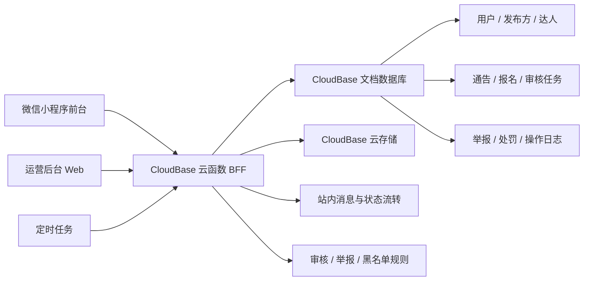

# 多米通告 技术架构与选型方案 V1

## 1. 文档说明

- 文档名称：技术架构与选型方案 V1
- 对应产品文档：[PRD-V1.md](../product/PRD-V1.md)
- 对应后台需求：[Admin-Operations-Backend-PRD-V1.md](../product/Admin-Operations-Backend-PRD-V1.md)
- 对应字段字典：[Field-Dictionary-V1.md](../product/Field-Dictionary-V1.md)
- 对应状态流转：[Status-Flow-Matrix-V1.md](../product/Status-Flow-Matrix-V1.md)
- 文档日期：2026-03-16
- 文档目标：为多米通告 V1 锁定前后端技术路线、数据架构、后台架构与演进边界，避免开发启动后反复改栈

## 2. 选型前提

结合当前产品文档，V1 技术方案必须满足以下约束：

1. 载体固定为微信小程序，不做多端同步开发。
2. V1 目标是尽快跑通“发布、审核、浏览、报名、消息、举报”闭环，而不是先搭复杂平台底座。
3. 用户进入即允许浏览，不做传统注册登录页。
4. 平台有明确审核、举报、黑名单和联系方式可见性控制，不能把核心权限判断放在前端。
5. 项目初期更重上线速度和运维成本，而不是过早追求可横向扩容的重后端架构。

基于以上约束，V1 不适合一开始就走“自建 App Server + 自建数据库 + 自建对象存储 + 自建后台权限系统”的重型路线。

## 3. 技术选型结论

### 3.1 总体结论

多米通告 V1 推荐采用：

1. 前台：原生微信小程序 + TypeScript
2. 业务后端：腾讯云 CloudBase
3. 服务形态：云函数 BFF，而不是开放式 REST API 优先
4. 数据库：CloudBase 文档数据库
5. 文件存储：CloudBase 云存储
6. 运营后台：独立 Web 管理端，采用 Vue 3 + Vite + TypeScript + Element Plus

### 3.2 分层选型表

| 层级 | 选型 | V1 是否采用 | 原因 |
| --- | --- | --- | --- |
| 移动前端 | 原生微信小程序 + TypeScript + Sass | 是 | 只做微信端，原生方案最轻、包体最稳、调试和审核风险最低 |
| 跨端框架 | Taro / uni-app | 否 | 当前没有多端诉求，引入额外抽象只会增加复杂度 |
| 业务后端 | CloudBase 云函数 | 是 | 与小程序天然耦合，免登录用户识别成本低，适合冷启动 MVP |
| 自建 API 服务 | Express + MySQL | 否 | 开发与运维成本高，V1 不是最佳投入方向 |
| 数据库 | CloudBase 文档数据库 | 是 | 适合状态驱动、文档型业务模型，开发速度快 |
| 搜索引擎 | Elasticsearch / OpenSearch | 否 | V1 搜索和筛选维度有限，数据库索引足够承接 |
| 文件系统 | CloudBase 云存储 | 是 | 作品图、截图、举报证据都需要低成本托管 |
| 管理后台 | Vue 3 + Element Plus | 是 | 表格、筛选、审批、表单型后台效率最高 |
| 即时通信 | IM / WebSocket | 否 | PRD 明确 V1 不做站内即时聊天 |
| 推送通知 | 站内消息为主，订阅消息为辅 | 是 | 站内消息必须有，外部提醒作为增强能力 |

### 3.3 总体架构图



### 3.4 关键方案对比与定稿结论

#### 前台技术方案对比

| 方案 | 开发效率 | 运行稳定性 | 审核风险 | 后续扩展 | V1 结论 |
| --- | --- | --- | --- | --- | --- |
| 原生微信小程序 | 高 | 高 | 低 | 中 | 采用 |
| Taro | 中 | 中 | 中 | 高 | 不采用 |
| uni-app | 中 | 中 | 中 | 高 | 不采用 |

结论：

1. V1 只有微信端，原生方案综合收益最高。
2. Taro 和 uni-app 的优势在多端，不在当前阶段。

#### 后端方案对比

| 方案 | 启动成本 | 身份接入成本 | 运维成本 | 复杂业务承载 | V1 结论 |
| --- | --- | --- | --- | --- | --- |
| CloudBase 云函数 + 文档库 | 低 | 低 | 低 | 中 | 采用 |
| Express + MySQL | 中高 | 中高 | 中高 | 高 | 不采用 |
| NestJS + MySQL / PostgreSQL | 高 | 中高 | 中高 | 高 | 不采用 |

结论：

1. 当前阶段优先低成本闭环，不优先重服务治理能力。
2. 复杂度真正起来后，再把高复杂域逐步迁出。

#### 后台方案对比

| 方案 | 审核效率 | 表格筛选能力 | 内部使用成本 | V1 结论 |
| --- | --- | --- | --- | --- |
| Web 管理后台 | 高 | 高 | 中 | 采用 |
| 小程序后台 | 低 | 低 | 低 | 不采用 |

结论：

1. 审核、举报、黑名单等内部场景天然更适合桌面 Web。

## 4. 为什么 V1 不选自建 Express 后端

Express 本身没有问题，但对当前项目阶段不是最优解。

### 4.1 不选原因

1. 你当前做的是单一微信小程序，不是多端统一 API 平台。
2. V1 的核心难点在审核流、权限和冷启动，不在高并发交易链路。
3. 自建 Express 意味着还要同时解决部署、鉴权、数据库、对象存储、日志、监控、备份、运维。
4. 小程序天然身份在 CloudBase 里可直接拿到 `OPENID`，若自建后端反而要额外处理登录态桥接。

### 4.2 什么时候再引入 Express

在以下场景出现之前，不建议升级为独立 API 服务：

1. 小程序之外新增 H5、App、开放 API 等多终端接入
2. 广场检索、广告投放、推荐排序变得明显复杂
3. 审核、消息、统计、广告结算出现明显异步任务压力
4. 需要将运营后台、广告系统、风控系统拆成独立服务

结论：

V1 先用 CloudBase 跑通闭环，等业务证明成立后，再把高复杂模块逐步迁出，成本最低。

## 5. 前台小程序技术方案

### 5.1 推荐栈

1. 原生微信小程序
2. TypeScript
3. Sass 或 SCSS
4. 自定义组件体系
5. 原生 `wx.cloud` 能力接入

### 5.2 为什么前台不用 Taro / uni-app

1. 当前没有多端复用诉求。
2. UI 已经明确按微信小程序边界定稿，原生实现最稳。
3. 发布、审核、消息、表单这些页面没有必要引入额外运行时。
4. 原生方案对包体、性能、真机调试、审核兼容性更友好。

### 5.3 前端工程组织建议

```text
miniprogram/
  app.ts
  app.json
  app.scss
  pages/
    plaza/
    publish/
    notice-detail/
    apply/
    messages/
    mine/
  components/
    notice-card/
    status-tag/
    filter-sheet/
    bottom-action-bar/
  services/
    user.service.ts
    notice.service.ts
    application.service.ts
    review.service.ts
  models/
    user.ts
    notice.ts
    application.ts
  constants/
    enums.ts
    routes.ts
  utils/
    request.ts
    auth.ts
    format.ts
  typings/
    cloud-functions.d.ts
```

### 5.4 前端架构原则

1. 页面层只负责展示和交互，不直接写业务规则。
2. 枚举、状态文案、字段映射统一由 `constants + models` 管理。
3. 所有核心读写通过 `services` 发起，不允许页面直接散落调用云函数。
4. 资料完整度、联系方式释放、账号限制、审核状态等规则不在前端硬编码判断。

### 5.5 状态管理建议

V1 不建议一开始上重型全局状态库。

推荐策略：

1. 页面内状态：页面自身 `data`
2. 全局轻状态：`App.globalData` + 小型 store 封装
3. 持久化缓存：`wx.setStorageSync`

只把以下内容放到全局：

1. 当前用户基础档案
2. 角色能力标记
3. 轻量配置字典
4. 最近使用的筛选条件

### 5.6 前端职责边界

前端只负责以下事情：

1. 页面渲染与交互反馈
2. 表单输入、上传、筛选、分页
3. 展示服务端返回的当前可见数据
4. 根据服务端返回状态控制页面文案和按钮样式

前端不负责以下事情：

1. 判断联系方式是否应该释放
2. 判断账号是否被限制发布或报名
3. 直接写业务状态
4. 拼接后台审核口径

## 6. 后端与服务层技术方案

### 6.1 推荐栈

1. CloudBase 云函数
2. TypeScript 编写，编译后部署
3. 文档数据库承载业务主数据
4. 云存储承载图片和证据文件
5. 定时任务承载过期状态流转和日常清理

### 6.2 为什么采用“云函数 BFF”

V1 推荐把云函数当作小程序后端 BFF，而不是让前端直接操作核心业务集合。

原因：

1. 可统一权限校验
2. 可屏蔽敏感字段，如联系方式、OpenID、处罚信息
3. 可统一状态流转和操作日志
4. 后续迁移到独立服务时，前端调用层几乎不用重写

### 6.3 云函数拆分建议

不要做一个超大的 `api` 函数，也不要做过细碎的几十个函数。

推荐按业务域拆分：

| 云函数 | 责任 |
| --- | --- |
| `user-bff` | 当前用户档案、角色能力、资料完整度 |
| `publisher-bff` | 发布方资料读写 |
| `creator-bff` | 达人名片读写 |
| `notice-bff` | 通告列表、详情、发布、编辑、关闭 |
| `application-bff` | 报名提交、报名列表、报名详情、状态推进 |
| `message-bff` | 站内消息列表、已读归档 |
| `report-bff` | 举报提交、举报记录 |
| `review-admin` | 审核任务列表、详情、处理动作 |
| `governance-admin` | 黑名单、处罚、运营处理记录 |
| `cron-jobs` | 过期任务、状态自动流转、补偿任务 |

### 6.4 关键后端原则

1. 前端不得直接写入 `noticeStatus`、`applicationStatus`、`accountStatus`。
2. 所有状态切换都要经由云函数，并记录操作日志。
3. 所有涉及联系方式展示的逻辑都必须由服务端按权限矩阵裁剪返回。
4. 运营后台与小程序前台共用同一套业务服务和数据库，不做两套口径。

### 6.5 云函数接口风格

V1 推荐统一采用“按业务域分函数 + 函数内 action 路由”的方式。

示意：

```text
notice-bff
  - action: list
  - action: detail
  - action: create
  - action: update
  - action: close
```

统一返回结构建议：

```json
{
  "code": 0,
  "message": "ok",
  "data": {},
  "requestId": "trace-id"
}
```

错误结构建议：

```json
{
  "code": 40001,
  "message": "当前账号已被限制发布",
  "data": null,
  "requestId": "trace-id"
}
```

说明：

1. `code` 用于前端稳定处理，不直接依赖中文文案。
2. `message` 面向页面提示和日志查看。
3. `requestId` 用于排查线上问题。

### 6.6 业务模块归属

| 业务能力 | 前台小程序 | 云函数 BFF | 运营后台 |
| --- | --- | --- | --- |
| 广场列表与筛选 | 展示 | 查询、筛选、排序 | 否 |
| 通告发布与编辑 | 表单与上传 | 校验、写入、状态流转 | 否 |
| 报名与我的报名 | 展示与提交 | 校验、写入、状态推进 | 否 |
| 消息中心 | 展示 | 生成、查询、已读 | 否 |
| 举报与反馈 | 表单与上传 | 写入、状态记录 | 处理查看 |
| 审核与黑名单 | 否 | 审核动作执行 | 列表、详情、处理 |

## 7. 数据库选型与数据模型

### 7.1 选型结论

V1 使用 CloudBase 文档数据库，集合命名统一加项目前缀 `dm_`。

### 7.2 核心集合建议

| 集合 | 用途 |
| --- | --- |
| `dm_users` | 平台用户基础档案 |
| `dm_publisher_profiles` | 发布方资料 |
| `dm_creator_cards` | 达人名片 |
| `dm_notices` | 通告主表 |
| `dm_notice_review_tasks` | 审核任务 |
| `dm_applications` | 报名记录 |
| `dm_messages` | 站内消息 |
| `dm_reports` | 举报记录 |
| `dm_account_actions` | 黑名单、限制、处罚记录 |
| `dm_operation_logs` | 通用操作日志 |
| `dm_configs` | 枚举、广告位、审核规则等系统配置 |

### 7.3 数据建模原则

1. 主表以业务对象为中心，不做过度范式化。
2. 列表页优先读取快照字段，避免每次跨集合拼接。
3. 联系方式、处罚信息、OpenID 等敏感字段与展示字段分离。
4. 所有集合统一保留 `createdAt`、`updatedAt`、`createdBy`、`updatedBy`、`isDeleted`。

### 7.4 快照与反规范化策略

为提升列表查询效率，V1 建议做有限度的反规范化：

1. `dm_notices` 存发布方展示名、身份类型、资料完整度快照
2. `dm_applications` 存达人昵称、平台、粉丝量级、作品图快照
3. `dm_messages` 存消息标题、摘要和目标对象快照

原因：

1. 小程序列表页响应更快
2. 云函数逻辑更简单
3. 后续统计和审核回溯更稳定

### 7.5 索引建议

V1 至少建立以下索引：

1. `dm_notices`: `noticeStatus + cooperationPlatform + cooperationCategory + city + createdAt`
2. `dm_notices`: `publisherUserId + createdAt`
3. `dm_applications`: `noticeId + applicationStatus + createdAt`
4. `dm_applications`: `creatorUserId + createdAt`
5. `dm_notice_review_tasks`: `reviewTaskStatus + reviewStage + createdAt`
6. `dm_reports`: `reportStatus + createdAt`
7. `dm_messages`: `targetUserId + isRead + createdAt`

### 7.6 核心集合使用原则

1. `dm_users` 只存平台级用户基础档案，不承载具体业务详情。
2. `dm_notices` 是广场、详情、我的通告列表的唯一业务主表。
3. `dm_notice_review_tasks` 单独存任务流，避免和通告状态混用。
4. `dm_applications` 只保留一条“同达人同通告”的有效报名记录。
5. `dm_operation_logs` 只做追溯，不参与页面主查询。

## 8. 文件存储与媒体方案

### 8.1 选型结论

V1 文件统一走 CloudBase 云存储。

### 8.2 存储目录建议

```text
notice-images/
creator-portfolio/
report-evidence/
feedback-screenshots/
system-assets/
```

### 8.3 上传规则

1. 小程序前端只上传原始文件，不直接决定最终可见地址。
2. 云函数保存文件元信息与归属业务对象。
3. 举报证据、联系方式截图等敏感文件不返回公开下载链接。

## 9. 鉴权与权限方案

### 9.1 小程序用户鉴权

采用 CloudBase 原生用户识别能力。

结论：

1. 不做小程序登录页
2. 不做手机号登录作为前置条件
3. 云函数中使用微信上下文识别用户唯一身份

这与当前产品原则完全一致。

### 9.2 管理后台鉴权

管理后台不复用小程序用户身份。

推荐方案：

1. 独立 `dm_admin_users` 或系统配置中的管理员白名单
2. 管理员账号与角色独立维护
3. 所有后台操作通过管理端专用云函数执行
4. 云函数内按角色校验审核、举报、黑名单等权限

V1 角色保持与后台需求文档一致：

1. 审核员
2. 运营管理员
3. 超级管理员

### 9.3 权限边界原则

1. 小程序前台只拿到当前动作需要的最小字段
2. 联系方式是否释放由服务端判断
3. 已封禁或受限用户的写操作必须在服务端拦截
4. 后台所有高风险操作都写入 `dm_operation_logs`

## 10. 运营后台技术方案

### 10.1 选型结论

V1 运营后台推荐使用独立 Web 管理端：

1. Vue 3
2. Vite
3. TypeScript
4. Element Plus
5. Pinia
6. Vue Router

### 10.2 为什么后台不用再做成小程序

1. 审核、筛选、列表操作在桌面端效率更高
2. Element Plus 适合后台表格、筛选器、审批表单
3. 后台使用场景更偏内部办公，不需要受小程序包体与交互限制

### 10.3 后台模块建议

```text
admin-web/
  src/
    pages/
      dashboard/
      review-list/
      review-detail/
      report-list/
      report-detail/
      blacklist/
      operation-logs/
    services/
    stores/
    router/
    components/
```

### 10.4 后台部署建议

V1 可部署到 CloudBase 静态托管或同等轻量托管环境，与云函数后端配合。

## 11. 消息、搜索与异步任务

### 11.1 消息方案

V1 以站内消息为主。

最小闭环：

1. 所有关键状态变化写入 `dm_messages`
2. 消息中心从 `dm_messages` 读取
3. 审核通过、驳回、报名状态变化都产生消息

增强方案：

1. 对高价值节点追加订阅消息提醒
2. 订阅消息失败不影响站内消息闭环

### 11.2 搜索与筛选

V1 不引入独立搜索引擎。

实现方式：

1. 云函数接收搜索词与筛选条件
2. 文档数据库基于索引字段过滤
3. 标题关键词搜索先做轻量模糊匹配
4. 排序仅支持 `最新发布`

### 11.3 异步任务

V1 推荐通过定时任务和补偿任务承接以下逻辑：

1. 到期通告自动从 `active` 转为 `expired`
2. 过期报名或失效任务的清理
3. 审核 SLA 超时巡检
4. 每日统计聚合

## 12. 环境、部署与工程规范

### 12.1 环境规划

至少区分 3 套环境：

1. `dev`：本地联调与自测
2. `test`：提审前集成测试
3. `prod`：正式环境

### 12.2 部署边界

| 对象 | 部署方式 |
| --- | --- |
| 小程序前端 | 微信开发者工具 / CI 构建发布 |
| 云函数 | CloudBase 部署 |
| 管理后台 | 静态托管 |
| 数据库索引与配置 | 环境初始化脚本维护 |

### 12.3 工程规范建议

1. 全项目优先 TypeScript
2. 统一 ESLint + Prettier
3. 枚举名、集合名、状态名与文档保持一致
4. 所有云函数输入输出使用统一 DTO 约束

### 12.4 非功能目标

V1 虽然不是重平台，但仍建议先锁定最小非功能目标：

1. 广场列表接口常规响应目标：`< 800ms`
2. 通告详情接口常规响应目标：`< 500ms`
3. 发布、报名、举报等写操作响应目标：`< 1200ms`
4. 审核、举报、处罚动作必须保留完整操作记录
5. 任何关键状态流转都必须可追踪到操作者与时间
6. 正式环境必须具备最基本的错误日志与请求追踪能力

## 13. 安全与合规要点

### 13.1 必须服务端兜底的内容

1. 联系方式可见性
2. 账号限制状态
3. 审核动作与状态流转
4. 举报处理结果
5. 管理员权限边界

### 13.2 风险控制建议

1. 上传图片和文本发布前接入内容安全检查或敏感词过滤
2. 所有后台操作保留日志和操作者
3. 所有高风险状态变更保留原因分类和备注
4. 任何被处罚用户都要在写接口做二次校验

## 14. 推荐的 V1 开发顺序

### 阶段 1：基础底座

1. 小程序原生工程
2. CloudBase 环境初始化
3. 核心集合与索引
4. 用户、发布方资料、达人名片云函数

### 阶段 2：业务闭环

1. 通告发布与详情
2. 审核任务流
3. 广场列表与筛选
4. 报名与我的报名
5. 站内消息

### 阶段 3：治理与后台

1. 举报与举报记录
2. 黑名单与限制状态
3. 运营后台列表与详情
4. 操作日志与基础统计

## 15. 后续演进路线

当业务规模扩大时，推荐按下面顺序升级，而不是推倒重来：

1. 保留小程序前端与云函数调用协议不变
2. 将高复杂域逐步迁移到独立服务
3. 优先迁移搜索、广告、统计和后台审批域
4. 数据库仍可先保持文档库，等查询压力明显增大后再拆分

可演进目标：

1. Cloud Functions -> Cloud Run / 独立 Node 服务
2. 文档数据库 -> 混合存储架构
3. 简单筛选 -> 搜索服务
4. 站内消息 -> 消息中心 + 推送中心

### 15.1 本文档与后续开发文档的关系

这份文档不替代开发文档，它的角色是“总设计定盘”。

后续推荐派生出 3 份执行文档：

1. 小程序前端开发文档：页面目录、组件规范、状态处理、云函数调用约定
2. CloudBase 后端开发文档：集合结构、云函数清单、DTO、权限校验、状态流转实现
3. 运营后台开发文档：后台页面结构、列表筛选、审批动作、角色权限与日志规则

换句话说：

1. 本文档回答“用什么、为什么、边界怎么分”
2. 后续开发文档回答“具体怎么实现”

## 16. 当前仍需补齐但不阻塞选型的配置项

以下内容会影响开发启动，但不影响当前技术选型结论：

1. 小程序 `AppID`
2. CloudBase 环境 ID 与环境命名
3. 初始管理员名单
4. 管理后台部署域名或托管方式细节
5. 内容安全策略的最终接入方式

## 17. 最终结论

从 V1 视角看，多米通告的最优路线不是“做一套很重的互联网平台技术栈”，而是：

1. 前台用原生微信小程序，把体验和上线效率做到最好
2. 后端用 CloudBase，把微信身份、云函数、数据库、存储一体化用起来
3. 后台单独做 Web 管理端，保证审核和治理效率
4. 核心权限、状态和联系方式控制全部放在服务端

这套方案最符合你当前项目的真实阶段：启动快、成本低、可控、后续还能升级。
